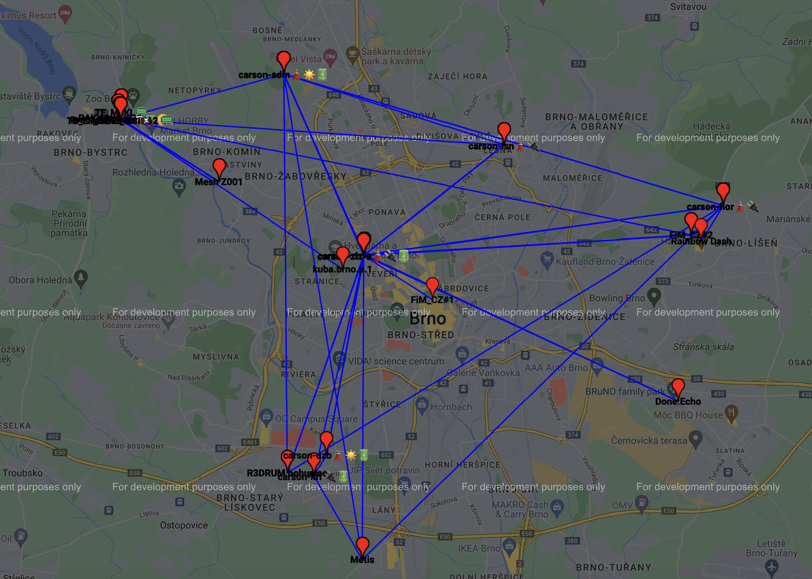
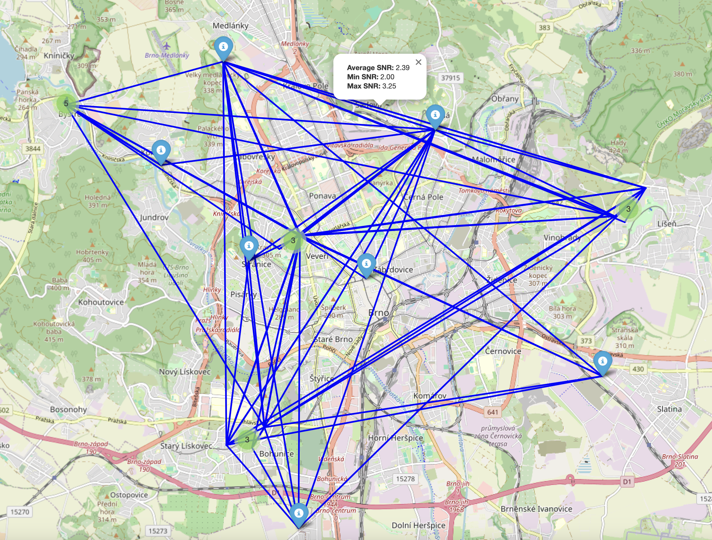

# Simple Python script to parse and save Meshtastic Packets to sqlite3 database

This is just proof of concept. 
Possibly nothing new and nothing special. 🗼📟📡
Script uses default Serial connection to connect to your device. 
Use regular microUSB or USB-C cable, connect to computer (drivers have to be installed). 

Tested with: 

- ✅ T-Echo
- ✅ Lilygo T3-S3
- ✅ RAK4631 WISBlock 19003

Feel free to do whatever you want with this script. 


Really basic setup :
```python
    # Initialize the serial interface
    interface = meshtastic.serial_interface.SerialInterface()

    # Subscribe to messages
    pub.subscribe(on_receive, "meshtastic.receive")
```

## Requirements

Requires `meshtastic` and `pytap2` and `sqlite3` modules.

```shell
pip3 install meshtastic
pip3 install pytap2
pip3 install networkx matplotlib meshtastic flask_socketio flask_cors pandas folium gmplot
```

Make sure pip and meshtastic is fully updated:

```shell
python3 -m pip install --upgrade pip
python3 -m pip install --upgrade meshtastic
```
Or just simply:

```shell
pip install -r requirements.txt
```

## Description

Basic setup of `SQLITE3` database for storing some data:

- Environment metrics (Temperature)
- Messages (Will keep track of all messages in default, and encrypted channels, also direct messages)
- Nodes (will try to make updated database of visible nodes)
    - **Update**: Added new columne for Node# (Neighbors)
    - Still missing MAC and other info to be collected. 
- Positions (will keep track of all possitions packet recieved)
- Telemetry (basic telemetry received from nodes)
- **New**: Added collection of Neighbor_Info from network `get-reply.py` only. 
- Traceroute (WORK IN PROGRESS) **Still doesn't collect!**

## Run 

```bash
python3 get-messages-to-db.py
```
Or running in background:

```shell
screen -L -Logfile ./output.log ./get-reply.py &
```

## Query database

```bash
sqlite3 messages.db
```

### List tables

```shell
sqlite> .tables
environment  nodes        routing      traceroute 
messages     positions    telemetry 
```

### Sample Query to DB to list telemetry for specific node
```sql
-- SQLite
SELECT 
    nodes.short_name, 
    nodes.long_name, 
    telemetry.battery_level,
    telemetry.voltage, 
    telemetry.channel_utilization, 
    telemetry.air_util_tx,
    --telemetry.uptime_seconds,
    printf('%d days, %d hours, %d minutes', 
           telemetry.uptime_seconds / 86400, 
           (telemetry.uptime_seconds % 86400) / 3600, 
           (telemetry.uptime_seconds % 3600) / 60) AS uptime,
    datetime(telemetry.timestamp, 'unixepoch') AS datetime
FROM telemetry 
JOIN nodes ON telemetry.node_id = nodes.node_id
WHERE nodes.short_name = 'node1';


```
## app.py (not fully working)

Added new python code, to render template HTML and generate some simple charts.
At this step just basic drawing of environment metrics. Temperature, humidity.
Already collected and stored into `sqlite3` database. 


## pong.py

Small app which will do the same like previous one, but it will try to pong you back when you send message `Ping` or `Alive?` to the node. 
Also if you send the `Ping` command the node will try to traceroute sender. 


## get-reply.py

To run the script on background (for example on Raspberry Pi ;-))
```bash
screen -L -Logfile ./output.log ./get-reply.py &
```

Actaully I've `Merged` two scripts in one actually it is `pong.py` and `get-messages-to-db.py` merged together. Will try to collect information gathered from meshnetwork to database and also replies basically to two commands `Ping` and `Alive?`. 

There is improved response in terms of reply on Ping. `thinking about adding traceroute back information` too. 

`Pong message:`
```shell
[Automatic Reply]
🏓 pong to !userid at 2024-08-17 16:46:59.
Hops away: 0
Receive time: 2024-08-17 15:32:50
```

New collection of `neighbor info` :

**Query**:
```sql
SELECT 
    n1.long_name AS node_long_name,
    n2.long_name AS neighbor_long_name,
    COUNT(neighbors.neighbor_node_id) AS total_neighbors,
    AVG(neighbors.snr) AS average_snr,
    MIN(neighbors.snr) AS min_snr,
    MAX(neighbors.snr) AS max_snr
FROM 
    neighbors
JOIN 
    nodes n1 ON neighbors.node_id = n1.node_number
LEFT JOIN 
    nodes n2 ON neighbors.neighbor_node_id = n2.node_number
GROUP BY 
    n1.long_name, n2.long_name
ORDER BY 
    n1.long_name, total_neighbors DESC;
```

Update collection of environment data. 

Select your temperature data collected.
**Query**
```sql
SELECT 
    n.long_name AS node_name,
    e.temperature AS temperature,
    e.humidity AS humidity,
    e.bar AS barometric_pressure,
    e.iaq AS air_quality_index,
    datetime(e.timestamp, 'unixepoch', 'localtime') AS european_time
FROM 
    environment e
JOIN 
    nodes n ON e.node_id = n.user_id
ORDER BY 
    n.long_name, european_time ASC;

```

## generate_googlemap_neighbors.py

Will generate `mesh_network_map.html` with positions from actual nodes and their neigbors. It is using data collected in table `neigbors` and using last known position from table `positions`. 

**Example**:


```sql
WITH LatestPositions AS (
    SELECT 
        p.node_id,
        p.latitude,
        p.longitude,
        p.altitude,
        datetime(p.timestamp, 'unixepoch', 'localtime') AS last_position_time,
        ROW_NUMBER() OVER (PARTITION BY p.node_id ORDER BY p.timestamp DESC) AS rn
    FROM 
        positions p
)
SELECT 
    n1.long_name AS node_long_name,
    n2.long_name AS neighbor_long_name,
    lp1.latitude AS node_latitude,
    lp1.longitude AS node_longitude,
    lp2.latitude AS neighbor_latitude,
    lp2.longitude AS neighbor_longitude
FROM 
    neighbors
JOIN 
    nodes n1 ON neighbors.node_id = n1.node_number
LEFT JOIN 
    nodes n2 ON neighbors.neighbor_node_id = n2.node_number
LEFT JOIN 
    LatestPositions lp1 ON n1.user_id = lp1.node_id AND lp1.rn = 1
LEFT JOIN 
    LatestPositions lp2 ON n2.user_id = lp2.node_id AND lp2.rn = 1
GROUP BY 
    n1.long_name, n2.long_name
ORDER BY 
    n1.long_name;
```

## generate_osm_neighbors.py

Same as google, just using OSM (OpenStreetMap) to draw positions and SNR lines to neighbor nodes into map. 




Query used in this case:

```sql
WITH LatestPositions AS (
    SELECT 
        p.node_id,
        p.latitude,
        p.longitude,
        p.altitude,
        datetime(p.timestamp, 'unixepoch', 'localtime') AS last_position_time,
        ROW_NUMBER() OVER (PARTITION BY p.node_id ORDER BY p.timestamp DESC) AS rn
    FROM 
        positions p
)
SELECT 
    n1.long_name AS node_long_name,
    n2.long_name AS neighbor_long_name,
    lp1.latitude AS node_latitude,
    lp1.longitude AS node_longitude,
    lp2.latitude AS neighbor_latitude,
    lp2.longitude AS neighbor_longitude,
    AVG(neighbors.snr) AS average_snr,
    MIN(neighbors.snr) AS min_snr,
    MAX(neighbors.snr) AS max_snr
FROM 
    neighbors
JOIN 
    nodes n1 ON neighbors.node_id = n1.node_number
LEFT JOIN 
    nodes n2 ON neighbors.neighbor_node_id = n2.node_number
LEFT JOIN 
    LatestPositions lp1 ON n1.user_id = lp1.node_id AND lp1.rn = 1
LEFT JOIN 
    LatestPositions lp2 ON n2.user_id = lp2.node_id AND lp2.rn = 1
WHERE
    lp1.latitude IS NOT NULL AND lp1.longitude IS NOT NULL AND
    lp2.latitude IS NOT NULL AND lp2.longitude IS NOT NULL
GROUP BY 
    n1.long_name, n2.long_name
ORDER BY 
    n1.long_name;
```