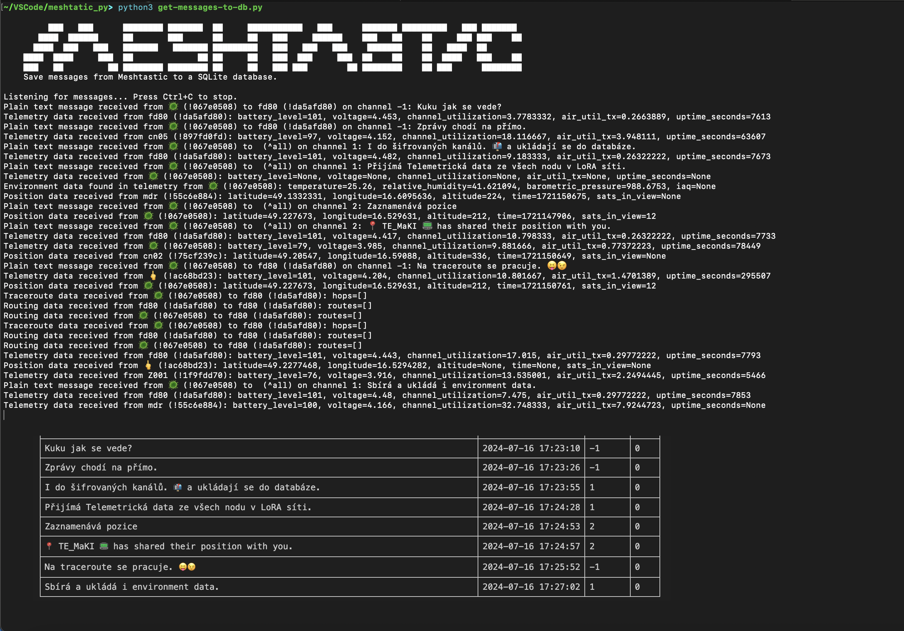
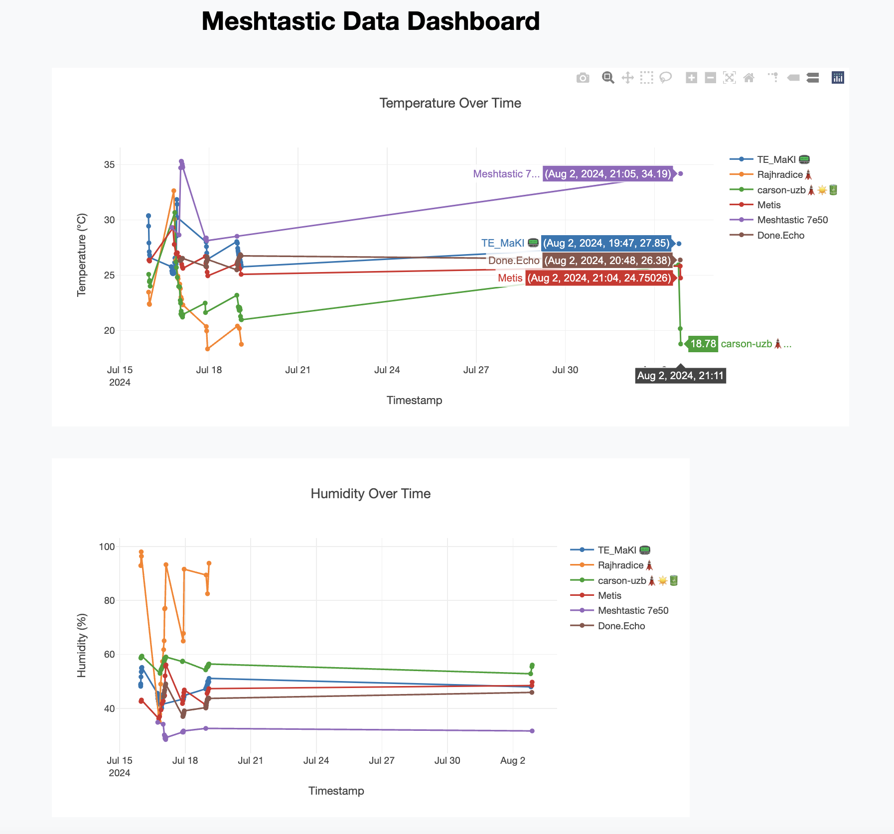
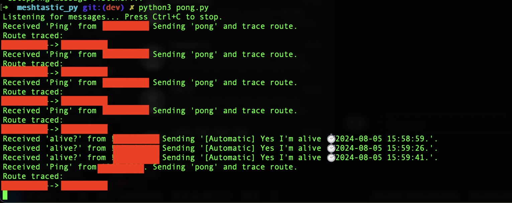

# Simple Python script to parse and save Meshtastic Packets to sqlite3 database

This is just proof of concept. 
Possibly nothing new and nothing special. 🗼📟📡
Script uses default Serial connection to connect to your device. 
Use regular microUSB or USB-C cable, connect to computer (drivers have to be installed). 

Tested with: 

- ✅ T-Echo
- ✅ Lilygo T3-S3
- ✅ RAK4631 WISBlock 19003

Feel free to do whatever you want with this script. 



Really basic setup :
```python
    # Initialize the serial interface
    interface = meshtastic.serial_interface.SerialInterface()

    # Subscribe to messages
    pub.subscribe(on_receive, "meshtastic.receive")
```

## Requirements

Requires `meshtastic` and `pytap2` and `sqlite3` modules.

```shell
pip3 install meshtastic
pip3 install pytap2
```

Make sure pip and meshtastic is fully updated:

```shell
python3 -m pip install --upgrade pip
python3 -m pip install --upgrade meshtastic
```

## Description

Basic setup of `SQLITE3` database for storing some data:

- Environment metrics (Temperature)
- Messages (Will keep track of all messages in default, and encrypted channels, also direct messages)
- Nodes (will try to make updated database of visible nodes)
- Positions (will keep track of all possitions packet recieved)
- Telemetry (basic telemetry received from nodes)
- Traceroute (WORK IN PROGRESS)

## Run 

```bash
python3 get-messages-to-db.py
```


## Query database

```bash
sqlite3 messages.db
```

### List tables

```shell
sqlite> .tables
environment  nodes        routing      traceroute 
messages     positions    telemetry 
```

### Sample Query to DB to list telemetry for specific node
```sql
-- SQLite
SELECT 
    nodes.short_name, 
    nodes.long_name, 
    telemetry.battery_level,
    telemetry.voltage, 
    telemetry.channel_utilization, 
    telemetry.air_util_tx,
    --telemetry.uptime_seconds,
    printf('%d days, %d hours, %d minutes', 
           telemetry.uptime_seconds / 86400, 
           (telemetry.uptime_seconds % 86400) / 3600, 
           (telemetry.uptime_seconds % 3600) / 60) AS uptime,
    datetime(telemetry.timestamp, 'unixepoch') AS datetime
FROM telemetry 
JOIN nodes ON telemetry.node_id = nodes.node_id
WHERE nodes.short_name = 'node1';


```
## app.py

Added new python code, to render template HTML and generate some simple charts.
At this step just basic drawing of environment metrics. Temperature, humidity.
Already collected and stored into `sqlite3` database. 




## pong.py

Small app which will do the same like previous one, but it will try to pong you back when you send message `Ping` or `Alive?` to the node. 
Also if you send the `Ping` command the node will try to traceroute sender. 

